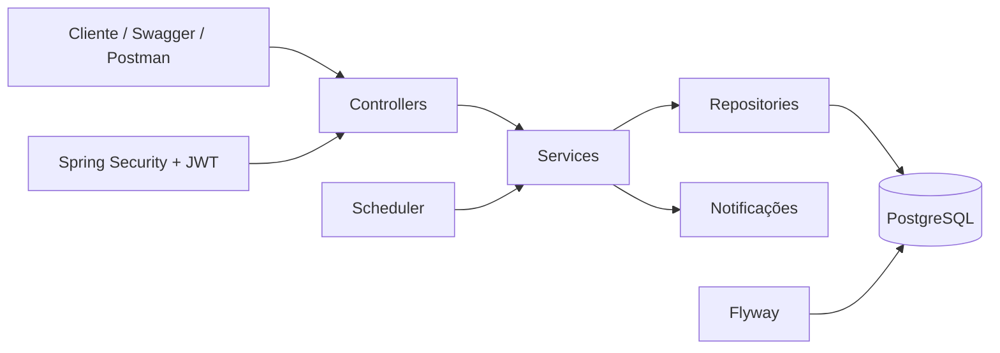
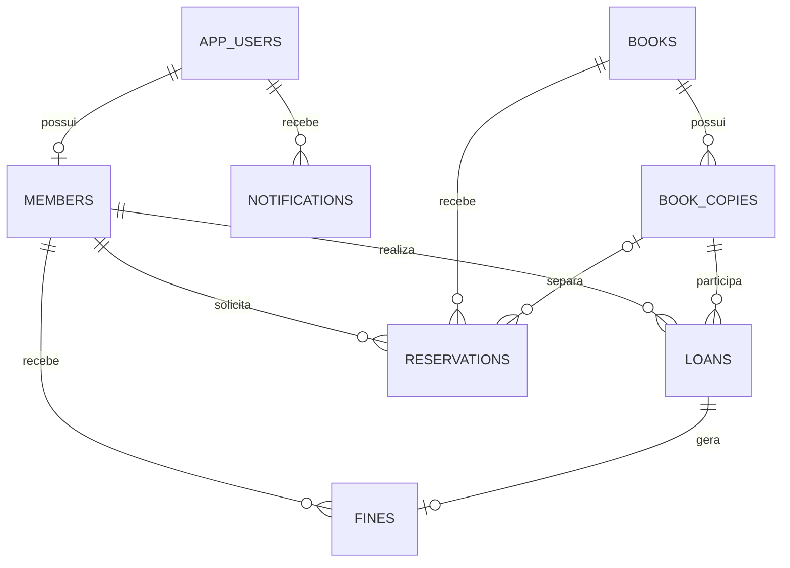

<div align="center">

# 📚 Library Management API

API REST para gerenciamento completo de bibliotecas, com autenticação JWT, controle de acesso por perfis, empréstimos, reservas, multas, notificações e persistência em PostgreSQL.


</div>

---

## 📌 Sobre o projeto

O **Library Management API** é um sistema back-end desenvolvido para representar operações reais de uma biblioteca. O projeto centraliza o gerenciamento de livros, exemplares físicos, membros, empréstimos, devoluções, renovações, reservas, multas e notificações.

A aplicação foi construída com foco em boas práticas de desenvolvimento back-end, separação de responsabilidades, segurança, persistência relacional, validação de dados, tratamento padronizado de erros e execução reproduzível com Docker.

## 📑 Sumário

- [Funcionalidades](#-funcionalidades)
- [Perfis e permissões](#-perfis-e-permissões)
- [Regras de negócio](#-regras-de-negócio)
- [Tecnologias](#-tecnologias)
- [Arquitetura](#-arquitetura)
- [Modelo de dados](#-modelo-de-dados)
- [Como executar com Docker](#-como-executar-com-docker)
- [Como executar sem Docker](#-como-executar-sem-docker)
- [Autenticação](#-autenticação)
- [Endpoints](#-endpoints)
- [Exemplos de uso](#-exemplos-de-uso)
- [Variáveis de ambiente](#-variáveis-de-ambiente)
- [Testes e integração contínua](#-testes-e-integração-contínua)
- [Estrutura do projeto](#-estrutura-do-projeto)
- [Documentação complementar](#-documentação-complementar)
- [Roadmap](#-roadmap)
- [Licença](#-licença)
- [Autor](#-autor)

## ✨ Funcionalidades

- Autenticação stateless com **JWT Access Token** e **Refresh Token**.
- Autorização baseada nos perfis `ADMIN`, `LIBRARIAN` e `MEMBER`.
- Cadastro público de membros.
- Administração de funcionários e status de acesso.
- Cadastro, consulta, edição e desativação de livros.
- Controle individual de exemplares por código de inventário.
- Busca de livros por título, autor, ISBN, categoria e disponibilidade.
- Cadastro, consulta, atualização e bloqueio de membros.
- Registro de empréstimos com prazo configurável.
- Devolução com cálculo automático de multa por atraso.
- Renovação de empréstimos com validação de prazo e reservas pendentes.
- Fila de reservas por ordem de solicitação.
- Separação automática de exemplares para o próximo membro da fila.
- Expiração automática de reservas não retiradas.
- Notificações internas de vencimento, atraso, multa e reserva disponível.
- Processamento diário de prazos com `@Scheduled`.
- Paginação e filtros nas principais consultas.
- Migrations do banco de dados com Flyway.
- Documentação interativa com Swagger/OpenAPI.
- Health check com Spring Boot Actuator.
- Collection do Postman pronta para importação.
- Pipeline de integração contínua com GitHub Actions.
- Proteção contra empréstimos simultâneos do mesmo exemplar.

## 👥 Perfis e permissões

| Perfil | Permissões principais |
|---|---|
| `ADMIN` | Acesso administrativo completo, gerenciamento de funcionários, livros, membros, empréstimos, multas e tarefas manuais. |
| `LIBRARIAN` | Gerenciamento de catálogo, membros, empréstimos, devoluções, reservas e pagamentos de multas. |
| `MEMBER` | Consulta do catálogo, reservas próprias, empréstimos próprios, renovações, multas e notificações. |

## 📏 Regras de negócio

- O membro precisa estar com status `ACTIVE` para realizar empréstimos ou reservas.
- Cada membro possui um limite configurável de empréstimos simultâneos.
- Membros com empréstimos atrasados não podem realizar novos empréstimos nem renovações.
- Multas pendentes acima do limite configurado bloqueiam novos empréstimos e renovações.
- O prazo padrão de empréstimo é de **14 dias**, podendo ser informado entre **1 e 60 dias**.
- Cada empréstimo pode ser renovado até **2 vezes**, desde que não esteja vencido e não existam reservas pendentes para o livro.
- Um exemplar não pode possuir mais de um empréstimo ativo ao mesmo tempo.
- Um membro não pode possuir duas reservas ativas para o mesmo livro.
- Reservas só podem ser feitas quando não há exemplares disponíveis.
- Quando um exemplar é devolvido, ele é destinado ao primeiro membro da fila de reservas.
- Uma reserva pronta permanece disponível por **48 horas**.
- Devoluções atrasadas geram multa diária de **R$ 2,00** por exemplar.
- O processamento automático de prazos ocorre diariamente às **08:00**, no fuso `America/Maceio`.

Os valores acima podem ser alterados por variáveis de ambiente.

## 🛠 Tecnologias

| Categoria | Tecnologia |
|---|---|
| Linguagem | Java 21 |
| Framework | Spring Boot 3.5 |
| API REST | Spring Web MVC |
| Persistência | Spring Data JPA / Hibernate |
| Segurança | Spring Security, OAuth2 Resource Server e JWT |
| Banco de dados | PostgreSQL 17 |
| Migrations | Flyway |
| Validação | Jakarta Bean Validation |
| Documentação | Springdoc OpenAPI / Swagger UI |
| Build | Maven |
| Containers | Docker e Docker Compose |
| Testes | JUnit 5, Spring Boot Test, Spring Security Test e H2 |
| CI | GitHub Actions |
| Produtividade | Lombok |

## 🏗 Arquitetura

A aplicação segue uma arquitetura em camadas:



### Responsabilidades

- **Controllers:** exposição dos endpoints HTTP e validação das requisições.
- **Services:** regras de negócio e controle transacional.
- **Repositories:** acesso aos dados com Spring Data JPA.
- **Security:** autenticação JWT e autorização por perfil.
- **Scheduler:** processamento automático de prazos, atrasos e reservas expiradas.
- **Flyway:** criação e versionamento do esquema do banco.

## 🗃 Modelo de dados



Principais estados do domínio:

| Entidade | Estados |
|---|---|
| Exemplar | `AVAILABLE`, `LOANED`, `RESERVED`, `LOST`, `DAMAGED`, `MAINTENANCE` |
| Empréstimo | `ACTIVE`, `RETURNED`, `OVERDUE`, `LOST` |
| Reserva | `WAITING`, `READY`, `FULFILLED`, `CANCELLED`, `EXPIRED` |
| Multa | `PENDING`, `PAID`, `CANCELLED` |
| Membro | `ACTIVE`, `BLOCKED`, `INACTIVE` |

## 🐳 Como executar com Docker

### Pré-requisitos

- Git
- Docker Desktop ou Docker Engine
- Docker Compose

### 1. Clone o repositório

```bash
git clone https://github.com/developercarloslima/library-management-api.git
cd library-management-api
```

### 2. Crie o arquivo de ambiente

Linux ou macOS:

```bash
cp .env.example .env
```

Windows PowerShell:

```powershell
Copy-Item .env.example .env
```

### 3. Inicie os containers

```bash
docker compose up --build
```

Para iniciar em segundo plano:

```bash
docker compose up --build -d
```

### 4. Acesse a aplicação

| Serviço | Endereço |
|---|---|
| API | `http://localhost:8080` |
| Swagger UI | `http://localhost:8080/swagger-ui.html` |
| OpenAPI JSON | `http://localhost:8080/v3/api-docs` |
| Health check | `http://localhost:8080/actuator/health` |
| PostgreSQL | `localhost:5432` |

### Comandos úteis

```bash
# Visualizar os containers
docker compose ps

# Acompanhar os logs da API
docker compose logs -f api

# Parar os containers
docker compose down

# Parar e apagar o volume do banco
docker compose down -v
```

> [!WARNING]
> O comando `docker compose down -v` remove permanentemente todos os dados cadastrados no banco local.

## 💻 Como executar sem Docker

### Pré-requisitos

- Java 21
- Maven 3.6 ou superior
- PostgreSQL

Crie um banco chamado `library_db` e defina as variáveis de ambiente necessárias.

Linux ou macOS:

```bash
export DB_URL=jdbc:postgresql://localhost:5432/library_db
export DB_USERNAME=library
export DB_PASSWORD=library
export APP_JWT_SECRET=uma-chave-segura-com-pelo-menos-32-caracteres
mvn spring-boot:run
```

Windows PowerShell:

```powershell
$env:DB_URL="jdbc:postgresql://localhost:5432/library_db"
$env:DB_USERNAME="library"
$env:DB_PASSWORD="library"
$env:APP_JWT_SECRET="uma-chave-segura-com-pelo-menos-32-caracteres"
mvn spring-boot:run
```

## 🔐 Autenticação

Na primeira inicialização, a aplicação cria automaticamente um administrador, caso o e-mail configurado ainda não exista.

| Campo | Valor padrão |
|---|---|
| E-mail | `admin@library.local` |
| Senha | `Admin@123456` |

> [!CAUTION]
> As credenciais padrão são destinadas apenas ao ambiente local. Altere `ADMIN_EMAIL`, `ADMIN_PASSWORD` e `APP_JWT_SECRET` antes de publicar ou implantar a aplicação.

### Realizar login

```bash
curl --request POST \
  --url http://localhost:8080/api/auth/login \
  --header 'Content-Type: application/json' \
  --data '{
    "email": "admin@library.local",
    "password": "Admin@123456"
  }'
```

Exemplo de resposta:

```json
{
  "tokenType": "Bearer",
  "accessToken": "eyJhbGciOiJIUzI1NiJ9...",
  "refreshToken": "eyJhbGciOiJIUzI1NiJ9...",
  "expiresIn": 1800
}
```

Envie o `accessToken` nas requisições protegidas:

```http
Authorization: Bearer SEU_ACCESS_TOKEN
```

### Autorizar pelo Swagger

1. Acesse `http://localhost:8080/swagger-ui.html`.
2. Execute `POST /api/auth/login`.
3. Copie o valor de `accessToken`.
4. Clique em **Authorize**.
5. Cole o token no campo de autenticação.

## 🌐 Endpoints

### Autenticação e perfil

| Método | Endpoint | Acesso | Descrição |
|---|---|---|---|
| `POST` | `/api/auth/register` | Público | Cadastra um novo membro. |
| `POST` | `/api/auth/login` | Público | Autentica um usuário. |
| `POST` | `/api/auth/refresh` | Público | Gera novos tokens a partir do refresh token. |
| `GET` | `/api/me` | Autenticado | Retorna o perfil do usuário autenticado. |

### Funcionários

| Método | Endpoint | Acesso | Descrição |
|---|---|---|---|
| `POST` | `/api/staff` | `ADMIN` | Cadastra administrador ou bibliotecário. |
| `GET` | `/api/staff` | `ADMIN` | Lista funcionários. |
| `PATCH` | `/api/staff/{id}/status` | `ADMIN` | Ativa ou desativa um funcionário. |

### Livros e exemplares

| Método | Endpoint | Acesso | Descrição |
|---|---|---|---|
| `GET` | `/api/books` | Autenticado | Pesquisa livros com filtros e paginação. |
| `GET` | `/api/books/{id}` | Autenticado | Consulta um livro. |
| `POST` | `/api/books` | `ADMIN`, `LIBRARIAN` | Cadastra um livro. |
| `PUT` | `/api/books/{id}` | `ADMIN`, `LIBRARIAN` | Atualiza um livro. |
| `DELETE` | `/api/books/{id}` | `ADMIN` | Desativa um livro. |
| `POST` | `/api/books/{bookId}/copies` | `ADMIN`, `LIBRARIAN` | Cadastra um exemplar. |
| `GET` | `/api/books/{bookId}/copies` | Autenticado | Lista os exemplares de um livro. |
| `PATCH` | `/api/books/copies/{copyId}/status` | `ADMIN`, `LIBRARIAN` | Atualiza o estado de um exemplar. |

Filtros disponíveis em `GET /api/books`:

```text
query=java
category=Tecnologia
availableOnly=true
page=0
size=20
sort=title,asc
```

### Membros

| Método | Endpoint | Acesso | Descrição |
|---|---|---|---|
| `POST` | `/api/members` | `ADMIN`, `LIBRARIAN` | Cadastra um membro. |
| `GET` | `/api/members` | `ADMIN`, `LIBRARIAN` | Lista membros. |
| `GET` | `/api/members/{id}` | `ADMIN`, `LIBRARIAN` | Consulta um membro. |
| `PUT` | `/api/members/{id}` | `ADMIN`, `LIBRARIAN` | Atualiza um membro. |
| `PATCH` | `/api/members/{id}/status` | `ADMIN`, `LIBRARIAN` | Altera o status de um membro. |

### Empréstimos

| Método | Endpoint | Acesso | Descrição |
|---|---|---|---|
| `POST` | `/api/loans` | `ADMIN`, `LIBRARIAN` | Registra um empréstimo. |
| `POST` | `/api/loans/{id}/return` | `ADMIN`, `LIBRARIAN` | Registra a devolução e calcula multa. |
| `POST` | `/api/loans/{id}/renew` | Autenticado | Renova um empréstimo permitido. |
| `GET` | `/api/loans/{id}` | Autenticado | Consulta um empréstimo permitido ao usuário. |
| `GET` | `/api/loans` | `ADMIN`, `LIBRARIAN` | Lista empréstimos com filtros. |
| `GET` | `/api/loans/mine` | `MEMBER` | Lista os empréstimos do membro autenticado. |

### Reservas

| Método | Endpoint | Acesso | Descrição |
|---|---|---|---|
| `POST` | `/api/reservations` | Autenticado | Cria uma reserva. |
| `GET` | `/api/reservations` | `ADMIN`, `LIBRARIAN` | Lista reservas. |
| `GET` | `/api/reservations/mine` | `MEMBER` | Lista as reservas do membro autenticado. |
| `DELETE` | `/api/reservations/{id}` | Proprietário ou funcionário | Cancela uma reserva ativa. |

### Multas

| Método | Endpoint | Acesso | Descrição |
|---|---|---|---|
| `GET` | `/api/fines` | `ADMIN`, `LIBRARIAN` | Lista multas. |
| `GET` | `/api/fines/mine` | `MEMBER` | Lista as multas do membro autenticado. |
| `POST` | `/api/fines/{id}/pay` | `ADMIN`, `LIBRARIAN` | Registra o pagamento de uma multa. |
| `POST` | `/api/fines/{id}/cancel` | `ADMIN` | Cancela uma multa. |

### Notificações e manutenção

| Método | Endpoint | Acesso | Descrição |
|---|---|---|---|
| `GET` | `/api/notifications` | Autenticado | Lista as notificações do usuário. |
| `PATCH` | `/api/notifications/{id}/read` | Autenticado | Marca uma notificação como lida. |
| `PATCH` | `/api/notifications/read-all` | Autenticado | Marca todas as notificações como lidas. |
| `POST` | `/api/admin/tasks/process-deadlines` | `ADMIN` | Executa manualmente o processamento de prazos. |

## 🧪 Exemplos de uso

### Cadastrar um livro

```bash
curl --request POST \
  --url http://localhost:8080/api/books \
  --header 'Authorization: Bearer SEU_ACCESS_TOKEN' \
  --header 'Content-Type: application/json' \
  --data '{
    "title": "Código Limpo",
    "isbn": "9788576082675",
    "author": "Robert C. Martin",
    "publisher": "Alta Books",
    "publicationYear": 2009,
    "category": "Engenharia de Software",
    "description": "Boas práticas para escrita de código legível e sustentável."
  }'
```

### Cadastrar um exemplar

```bash
curl --request POST \
  --url http://localhost:8080/api/books/ID_DO_LIVRO/copies \
  --header 'Authorization: Bearer SEU_ACCESS_TOKEN' \
  --header 'Content-Type: application/json' \
  --data '{
    "inventoryCode": "BOOK-0001",
    "acquisitionDate": "2026-07-15"
  }'
```

### Cadastrar um membro

```bash
curl --request POST \
  --url http://localhost:8080/api/members \
  --header 'Authorization: Bearer SEU_ACCESS_TOKEN' \
  --header 'Content-Type: application/json' \
  --data '{
    "name": "Maria Silva",
    "email": "maria@example.com",
    "password": "Senha@123",
    "phone": "82999999999",
    "maximumLoans": 3
  }'
```

### Registrar um empréstimo

```bash
curl --request POST \
  --url http://localhost:8080/api/loans \
  --header 'Authorization: Bearer SEU_ACCESS_TOKEN' \
  --header 'Content-Type: application/json' \
  --data '{
    "memberId": "ID_DO_MEMBRO",
    "bookCopyId": "ID_DO_EXEMPLAR",
    "loanDays": 14
  }'
```

## ⚙️ Variáveis de ambiente

| Variável | Valor padrão | Descrição |
|---|---|---|
| `DB_URL` | `jdbc:postgresql://postgres:5432/library_db` | URL JDBC do PostgreSQL. |
| `DB_USERNAME` | `library` | Usuário do banco. |
| `DB_PASSWORD` | `library` | Senha do banco. |
| `APP_JWT_SECRET` | Chave de desenvolvimento | Segredo HMAC do JWT, com no mínimo 32 caracteres. |
| `JWT_ACCESS_MINUTES` | `30` | Validade do access token em minutos. |
| `JWT_REFRESH_DAYS` | `7` | Validade do refresh token em dias. |
| `ADMIN_NAME` | `Administrador` | Nome do administrador inicial. |
| `ADMIN_EMAIL` | `admin@library.local` | E-mail do administrador inicial. |
| `ADMIN_PASSWORD` | `Admin@123456` | Senha do administrador inicial. |
| `SERVER_PORT` | `8080` | Porta HTTP da API. |
| `DEFAULT_LOAN_DAYS` | `14` | Prazo padrão dos empréstimos. |
| `MAX_RENEWALS` | `2` | Quantidade máxima de renovações. |
| `RESERVATION_HOLD_HOURS` | `48` | Prazo para retirada de uma reserva pronta. |
| `DUE_SOON_DAYS` | `2` | Antecedência da notificação de vencimento. |
| `DAILY_FINE` | `2.00` | Valor da multa por dia de atraso. |
| `MAX_UNPAID_FINE` | `20.00` | Limite de multas pendentes para bloqueio. |
| `DEADLINES_CRON` | `0 0 8 * * *` | Expressão cron do processamento de prazos. |
| `SCHEDULER_ZONE` | `America/Maceio` | Fuso horário do scheduler. |

> [!NOTE]
> O administrador inicial só é criado quando ainda não existe um usuário com o e-mail configurado. Para recriar o banco local com novas credenciais, execute `docker compose down -v` e suba os containers novamente.

## ✅ Testes e integração contínua

Execute os testes localmente:

```bash
mvn clean verify
```

O perfil de testes utiliza banco H2 em memória. O workflow localizado em `.github/workflows/ci.yml` executa o build e os testes automaticamente em pushes para `main`, `master` e `develop`, além de pull requests.

## 📂 Estrutura do projeto

```text
library-management-api/
├── .github/
│   └── workflows/
│       └── ci.yml
├── docs/
│   └── ERD.md
├── postman/
│   └── Library-Management-API.postman_collection.json
├── src/
│   ├── main/
│   │   ├── java/com/carlos/library/
│   │   │   ├── config/
│   │   │   ├── controller/
│   │   │   ├── domain/
│   │   │   │   ├── entity/
│   │   │   │   └── enums/
│   │   │   ├── dto/
│   │   │   ├── exception/
│   │   │   ├── repository/
│   │   │   ├── scheduler/
│   │   │   └── service/
│   │   └── resources/
│   │       ├── db/migration/
│   │       └── application.yml
│   └── test/
├── .env.example
├── docker-compose.yml
├── Dockerfile
├── LICENSE
├── pom.xml
└── README.md
```

## 📚 Documentação complementar

- **Swagger UI:** disponível em `/swagger-ui.html` com a aplicação em execução.
- **OpenAPI:** especificação JSON disponível em `/v3/api-docs`.
- **Postman:** importe `postman/Library-Management-API.postman_collection.json`.
- **Modelo de dados:** consulte `docs/ERD.md`.
- **Migration inicial:** consulte `src/main/resources/db/migration/V1__create_schema.sql`.

## 🚀 Roadmap

- [ ] Notificações por e-mail.
- [ ] Testes de integração com Testcontainers.
- [ ] Cobertura de testes com JaCoCo.
- [ ] Logs estruturados e observabilidade.
- [ ] Dashboard administrativo front-end.
- [ ] Upload de capas dos livros.
- [ ] Relatórios de livros mais emprestados e membros inadimplentes.
- [ ] Deploy automatizado em ambiente cloud.

## 🤝 Contribuição

Contribuições são bem-vindas.

1. Faça um fork do projeto.
2. Crie uma branch para sua alteração:

```bash
git checkout -b feature/minha-funcionalidade
```

3. Faça o commit:

```bash
git commit -m "feat: adiciona nova funcionalidade"
```

4. Envie a branch:

```bash
git push origin feature/minha-funcionalidade
```

5. Abra um Pull Request.

## 📄 Licença

Este projeto está licenciado sob a licença MIT. Consulte o arquivo [LICENSE](LICENSE) para mais informações.

## 👨‍💻 Autor

Desenvolvido por **Carlos Lima**.

[](https://github.com/developercarloslima)

---

<div align="center">

Projeto desenvolvido para demonstrar conhecimentos em **Java, Spring Boot, APIs REST, segurança JWT, PostgreSQL e Docker**.

</div>
