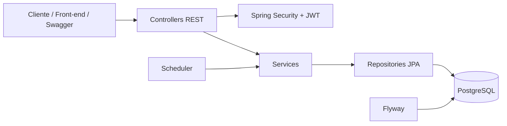
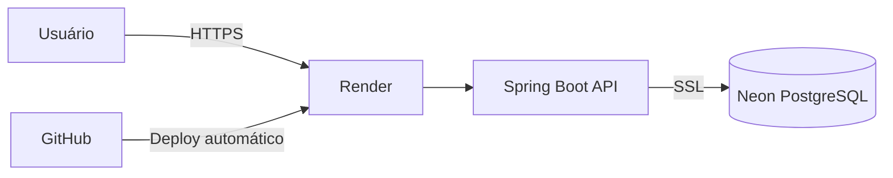
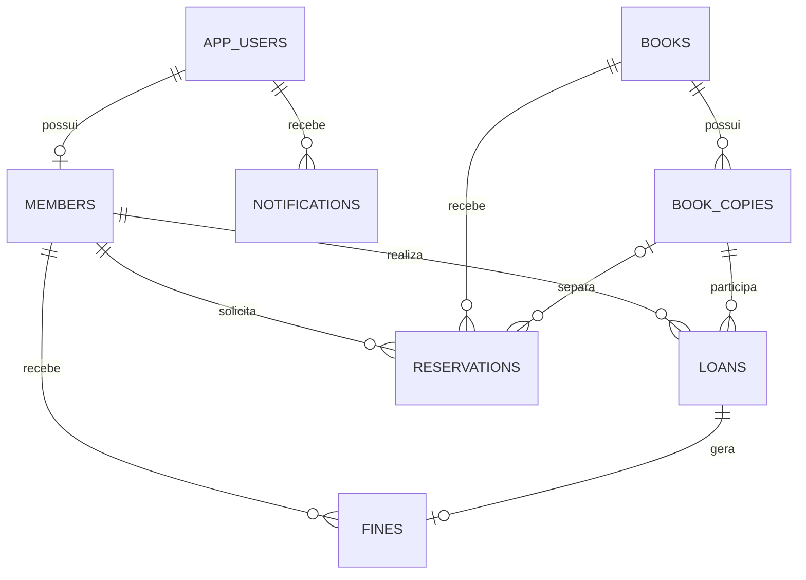

<div align="center">

# 📚 Library Management API

### Sistema back-end para gerenciamento completo de bibliotecas

API REST desenvolvida com **Java e Spring Boot**, com autenticação JWT, controle de acesso por perfis, empréstimos, devoluções, reservas, multas, notificações e persistência em PostgreSQL.

[](https://www.java.com/)
[](https://spring.io/projects/spring-boot)
[](https://www.postgresql.org/)
[](https://www.docker.com/)
[](https://jwt.io/)
[](https://render.com/)
[](https://neon.tech/)

</div>

---

## 🌐 Demonstração em produção

| Recurso | Endereço |
|---|---|
| **Swagger UI** | [Abrir documentação interativa](https://library-management-api-pcjj.onrender.com/swagger-ui/index.html) |
| **Health Check** | [Verificar status da API](https://library-management-api-pcjj.onrender.com/actuator/health) |
| **OpenAPI JSON** | [Visualizar especificação](https://library-management-api-pcjj.onrender.com/v3/api-docs) |
| **URL base da API** | [URL Oficial da API](https://library-management-api-pcjj.onrender.com) |

> [!NOTE]
> A aplicação está hospedada no plano gratuito do Render. Após um período sem acessos, o serviço pode entrar em suspensão. A primeira requisição seguinte poderá levar alguns segundos para responder.

---

## 📌 Sobre o projeto

O **Library Management API** representa as principais operações de uma biblioteca real. O sistema permite controlar o catálogo de livros, exemplares físicos, usuários, funcionários, empréstimos, devoluções, renovações, reservas, multas e notificações.

O projeto foi desenvolvido para demonstrar conhecimentos em:

- Desenvolvimento de APIs REST com Java.
- Arquitetura em camadas.
- Autenticação e autorização com JWT.
- Regras de negócio e controle transacional.
- Modelagem e persistência com PostgreSQL.
- Migrations com Flyway.
- Validação e tratamento global de erros.
- Containerização com Docker.
- Documentação com Swagger/OpenAPI.
- Deploy de uma aplicação Spring Boot em ambiente cloud.

---

## ✨ Funcionalidades

### Segurança e usuários

- Autenticação stateless com **Access Token** e **Refresh Token**.
- Senhas armazenadas com hash seguro.
- Controle de acesso por perfis:
  - `ADMIN`
  - `LIBRARIAN`
  - `MEMBER`
- Cadastro público de membros.
- Cadastro e gerenciamento de funcionários.
- Consulta do perfil do usuário autenticado.

### Catálogo

- Cadastro, consulta, edição e desativação de livros.
- Controle individual de exemplares físicos.
- Código de inventário único para cada exemplar.
- Busca com filtros e paginação.
- Controle de disponibilidade e estado dos exemplares.

### Empréstimos e devoluções

- Registro de empréstimos.
- Prazo de devolução configurável.
- Limite de empréstimos simultâneos por membro.
- Renovação com validação das regras de negócio.
- Registro de devolução.
- Atualização automática da disponibilidade do exemplar.
- Proteção contra empréstimos simultâneos do mesmo exemplar.

### Reservas

- Fila de reservas por ordem de solicitação.
- Proteção contra reservas duplicadas.
- Separação automática de exemplar para o próximo membro.
- Prazo configurável para retirada.
- Cancelamento e expiração de reservas.

### Multas e notificações

- Cálculo automático de multa por atraso.
- Pagamento e cancelamento de multas.
- Bloqueio de operações quando o limite de multas for excedido.
- Notificações de:
  - vencimento próximo;
  - empréstimo atrasado;
  - multa gerada;
  - reserva disponível;
  - reserva expirada.

### Administração

- Processamento automático de prazos com `@Scheduled`.
- Execução manual da rotina de manutenção por administrador.
- Health check com Spring Boot Actuator.
- Documentação interativa com Swagger.
- Collection do Postman.
- Pipeline de integração contínua com GitHub Actions.

---

## 👥 Perfis e permissões

| Perfil | Permissões |
|---|---|
| `ADMIN` | Acesso administrativo completo, funcionários, catálogo, membros, empréstimos, multas e rotinas manuais. |
| `LIBRARIAN` | Gerenciamento do catálogo, membros, empréstimos, devoluções, reservas e pagamentos de multas. |
| `MEMBER` | Consulta do catálogo, reservas próprias, empréstimos próprios, renovações, multas e notificações. |

---

## 📏 Principais regras de negócio

- O membro deve estar com status `ACTIVE`.
- Cada membro possui um limite de empréstimos simultâneos.
- Um exemplar não pode ter dois empréstimos ativos.
- Membros com empréstimos atrasados não podem realizar novos empréstimos.
- Multas pendentes acima do limite configurado bloqueiam novos empréstimos e renovações.
- O prazo padrão de empréstimo é de **14 dias**.
- O empréstimo pode ser renovado até **2 vezes**.
- Não é possível renovar um empréstimo vencido.
- Não é possível renovar quando outro membro está aguardando o livro.
- Reservas são organizadas em fila.
- Um membro não pode possuir duas reservas ativas para o mesmo livro.
- Uma reserva disponível permanece separada por **48 horas**.
- Devoluções atrasadas geram multa diária.
- O processamento de prazos ocorre automaticamente pelo scheduler.

Os valores podem ser alterados através de variáveis de ambiente.

---

## 🛠 Tecnologias

| Categoria | Tecnologia |
|---|---|
| Linguagem | Java 21 |
| Framework | Spring Boot 3.5 |
| API REST | Spring Web MVC |
| Segurança | Spring Security e JWT |
| Persistência | Spring Data JPA / Hibernate |
| Banco de dados | PostgreSQL |
| Migrations | Flyway |
| Validação | Jakarta Bean Validation |
| Documentação | Springdoc OpenAPI / Swagger UI |
| Build | Maven |
| Containers | Docker e Docker Compose |
| Testes | JUnit 5, Spring Boot Test e H2 |
| CI | GitHub Actions |
| Deploy | Render |
| PostgreSQL em produção | Neon |
| Produtividade | Lombok |

---

## 🏗 Arquitetura

### Arquitetura da aplicação



### Arquitetura em produção



### Organização em camadas

- **Controller:** exposição dos endpoints HTTP.
- **Service:** regras de negócio e controle transacional.
- **Repository:** acesso ao banco com Spring Data JPA.
- **Domain:** entidades e enums do domínio.
- **Security:** autenticação JWT e autorização por perfil.
- **Scheduler:** processamento automático de prazos.
- **Exception:** tratamento padronizado de erros.
- **Migration:** versionamento da estrutura do banco.

---

## 🗃 Modelo de dados



### Estados principais

| Entidade | Estados |
|---|---|
| Membro | `ACTIVE`, `BLOCKED`, `INACTIVE` |
| Exemplar | `AVAILABLE`, `LOANED`, `RESERVED`, `LOST`, `DAMAGED`, `MAINTENANCE` |
| Empréstimo | `ACTIVE`, `RETURNED`, `OVERDUE`, `LOST` |
| Reserva | `WAITING`, `READY`, `FULFILLED`, `CANCELLED`, `EXPIRED` |
| Multa | `PENDING`, `PAID`, `CANCELLED` |

---

## 🔐 Autenticação

A API utiliza JWT. O fluxo de autenticação é:

```text
Login
  ↓
Validação do e-mail e da senha
  ↓
Geração do Access Token e Refresh Token
  ↓
Envio do Access Token no header Authorization
  ↓
Validação do token pelo Spring Security
  ↓
Autorização de acordo com o perfil
```

### Login

```http
POST /api/auth/login
Content-Type: application/json
```

```json
{
  "email": "admin@example.com",
  "password": "sua-senha"
}
```

Exemplo de resposta:

```json
{
  "tokenType": "Bearer",
  "accessToken": "eyJhbGciOiJIUzI1NiJ9...",
  "refreshToken": "eyJhbGciOiJIUzI1NiJ9...",
  "expiresIn": 1800
}
```

Nas rotas protegidas:

```http
Authorization: Bearer SEU_ACCESS_TOKEN
```

### Autorização pelo Swagger

1. Execute `POST /api/auth/login`.
2. Copie o valor de `accessToken`.
3. Clique em **Authorize**, no topo do Swagger.
4. Cole o token.
5. Confirme a autorização.

> [!CAUTION]
> As credenciais de produção não são disponibilizadas neste repositório. Configure `ADMIN_EMAIL`, `ADMIN_PASSWORD` e `APP_JWT_SECRET` através das variáveis de ambiente.

---

## 🌐 Endpoints

### Autenticação e perfil

| Método | Endpoint | Acesso | Descrição |
|---|---|---|---|
| `POST` | `/api/auth/register` | Público | Cadastra um novo membro. |
| `POST` | `/api/auth/login` | Público | Autentica um usuário. |
| `POST` | `/api/auth/refresh` | Público | Gera novos tokens. |
| `GET` | `/api/me` | Autenticado | Retorna o perfil do usuário autenticado. |

### Funcionários

| Método | Endpoint | Acesso | Descrição |
|---|---|---|---|
| `POST` | `/api/staff` | `ADMIN` | Cadastra um funcionário. |
| `GET` | `/api/staff` | `ADMIN` | Lista funcionários. |
| `PATCH` | `/api/staff/{id}/status` | `ADMIN` | Altera o status de um funcionário. |

### Livros e exemplares

| Método | Endpoint | Acesso | Descrição |
|---|---|---|---|
| `GET` | `/api/books` | Autenticado | Lista e pesquisa livros. |
| `GET` | `/api/books/{id}` | Autenticado | Consulta um livro. |
| `POST` | `/api/books` | `ADMIN`, `LIBRARIAN` | Cadastra um livro. |
| `PUT` | `/api/books/{id}` | `ADMIN`, `LIBRARIAN` | Atualiza um livro. |
| `DELETE` | `/api/books/{id}` | `ADMIN` | Desativa um livro. |
| `POST` | `/api/books/{bookId}/copies` | `ADMIN`, `LIBRARIAN` | Cadastra um exemplar. |
| `GET` | `/api/books/{bookId}/copies` | Autenticado | Lista exemplares. |
| `PATCH` | `/api/books/copies/{copyId}/status` | `ADMIN`, `LIBRARIAN` | Altera o estado do exemplar. |

### Membros

| Método | Endpoint | Acesso | Descrição |
|---|---|---|---|
| `POST` | `/api/members` | `ADMIN`, `LIBRARIAN` | Cadastra um membro. |
| `GET` | `/api/members` | `ADMIN`, `LIBRARIAN` | Lista membros. |
| `GET` | `/api/members/{id}` | `ADMIN`, `LIBRARIAN` | Consulta um membro. |
| `PUT` | `/api/members/{id}` | `ADMIN`, `LIBRARIAN` | Atualiza um membro. |
| `PATCH` | `/api/members/{id}/status` | `ADMIN`, `LIBRARIAN` | Altera o status. |

### Empréstimos

| Método | Endpoint | Acesso | Descrição |
|---|---|---|---|
| `POST` | `/api/loans` | `ADMIN`, `LIBRARIAN` | Registra um empréstimo. |
| `GET` | `/api/loans` | `ADMIN`, `LIBRARIAN` | Lista empréstimos. |
| `GET` | `/api/loans/{id}` | Autenticado | Consulta um empréstimo. |
| `GET` | `/api/loans/mine` | `MEMBER` | Lista empréstimos do membro. |
| `POST` | `/api/loans/{id}/return` | `ADMIN`, `LIBRARIAN` | Registra a devolução. |
| `POST` | `/api/loans/{id}/renew` | Autenticado | Renova um empréstimo. |

### Reservas

| Método | Endpoint | Acesso | Descrição |
|---|---|---|---|
| `POST` | `/api/reservations` | Autenticado | Cria uma reserva. |
| `GET` | `/api/reservations` | `ADMIN`, `LIBRARIAN` | Lista reservas. |
| `GET` | `/api/reservations/mine` | `MEMBER` | Lista reservas do membro. |
| `DELETE` | `/api/reservations/{id}` | Autorizado | Cancela uma reserva. |

### Multas

| Método | Endpoint | Acesso | Descrição |
|---|---|---|---|
| `GET` | `/api/fines` | `ADMIN`, `LIBRARIAN` | Lista multas. |
| `GET` | `/api/fines/mine` | `MEMBER` | Lista multas do membro. |
| `POST` | `/api/fines/{id}/pay` | `ADMIN`, `LIBRARIAN` | Registra o pagamento. |
| `POST` | `/api/fines/{id}/cancel` | `ADMIN` | Cancela uma multa. |

### Notificações e manutenção

| Método | Endpoint | Acesso | Descrição |
|---|---|---|---|
| `GET` | `/api/notifications` | Autenticado | Lista notificações. |
| `PATCH` | `/api/notifications/{id}/read` | Autenticado | Marca como lida. |
| `PATCH` | `/api/notifications/read-all` | Autenticado | Marca todas como lidas. |
| `POST` | `/api/admin/tasks/process-deadlines` | `ADMIN` | Processa prazos manualmente. |

A especificação completa está disponível no [Swagger em produção](https://library-management-api-pcjj.onrender.com/swagger-ui/index.html).

---

## 🧪 Exemplo de fluxo

### 1. Cadastrar um livro

```http
POST /api/books
Authorization: Bearer SEU_ACCESS_TOKEN
Content-Type: application/json
```

```json
{
  "title": "Código Limpo",
  "isbn": "9788576082675",
  "author": "Robert C. Martin",
  "publisher": "Alta Books",
  "publicationYear": 2009,
  "category": "Engenharia de Software",
  "description": "Boas práticas para escrita de código legível e sustentável."
}
```

### 2. Cadastrar um exemplar

```http
POST /api/books/{bookId}/copies
Authorization: Bearer SEU_ACCESS_TOKEN
Content-Type: application/json
```

```json
{
  "inventoryCode": "BOOK-0001",
  "acquisitionDate": "2026-07-15"
}
```

### 3. Cadastrar um membro

```http
POST /api/members
Authorization: Bearer SEU_ACCESS_TOKEN
Content-Type: application/json
```

```json
{
  "name": "Maria Silva",
  "email": "maria@example.com",
  "password": "Senha@123",
  "phone": "82999999999",
  "maximumLoans": 3
}
```

### 4. Registrar o empréstimo

```http
POST /api/loans
Authorization: Bearer SEU_ACCESS_TOKEN
Content-Type: application/json
```

```json
{
  "memberId": "ID_DO_MEMBRO",
  "bookCopyId": "ID_DO_EXEMPLAR",
  "loanDays": 14
}
```

---

## 🐳 Executando com Docker

### Pré-requisitos

- Git
- Docker
- Docker Compose

### Clone o repositório

```bash
git clone https://github.com/developercarloslima/library-management-api.git
cd library-management-api
```

### Crie o arquivo `.env`

Linux ou macOS:

```bash
cp .env.example .env
```

Windows PowerShell:

```powershell
Copy-Item .env.example .env
```

### Inicie os containers

```bash
docker compose up --build
```

Em segundo plano:

```bash
docker compose up --build -d
```

### Endereços locais

| Serviço | Endereço |
|---|---|
| API | `http://localhost:8080` |
| Swagger | `http://localhost:8080/swagger-ui/index.html` |
| OpenAPI | `http://localhost:8080/v3/api-docs` |
| Health Check | `http://localhost:8080/actuator/health` |
| PostgreSQL | `localhost:5432` |

### Comandos úteis

```bash
# Ver containers
docker compose ps

# Acompanhar logs
docker compose logs -f api

# Reiniciar
docker compose restart

# Parar containers
docker compose down
```

> [!WARNING]
> `docker compose down -v` também apaga o volume e todos os dados do PostgreSQL local.

---

## 💻 Executando sem Docker

### Pré-requisitos

- Java 21
- Maven
- PostgreSQL

Crie um banco chamado `library_db` e configure as variáveis.

Linux ou macOS:

```bash
export DB_URL=jdbc:postgresql://localhost:5432/library_db
export DB_USERNAME=library
export DB_PASSWORD=library
export APP_JWT_SECRET=uma-chave-segura-com-pelo-menos-32-caracteres

mvn spring-boot:run
```

Windows PowerShell:

```powershell
$env:DB_URL="jdbc:postgresql://localhost:5432/library_db"
$env:DB_USERNAME="library"
$env:DB_PASSWORD="library"
$env:APP_JWT_SECRET="uma-chave-segura-com-pelo-menos-32-caracteres"

mvn spring-boot:run
```

---

## ⚙️ Variáveis de ambiente

| Variável | Padrão local | Descrição |
|---|---|---|
| `DB_URL` | `jdbc:postgresql://postgres:5432/library_db` | URL JDBC do PostgreSQL. |
| `DB_USERNAME` | `library` | Usuário do banco. |
| `DB_PASSWORD` | `library` | Senha do banco. |
| `APP_JWT_SECRET` | Desenvolvimento | Segredo de assinatura do JWT. |
| `JWT_ACCESS_MINUTES` | `30` | Validade do access token. |
| `JWT_REFRESH_DAYS` | `7` | Validade do refresh token. |
| `ADMIN_NAME` | `Administrador` | Nome do administrador inicial. |
| `ADMIN_EMAIL` | `admin@library.local` | E-mail inicial local. |
| `ADMIN_PASSWORD` | `Admin@123456` | Senha inicial local. |
| `SERVER_PORT` | `8080` | Porta HTTP da aplicação. |
| `DEFAULT_LOAN_DAYS` | `14` | Prazo padrão de empréstimo. |
| `MAX_RENEWALS` | `2` | Máximo de renovações. |
| `RESERVATION_HOLD_HOURS` | `48` | Prazo de retirada da reserva. |
| `DUE_SOON_DAYS` | `2` | Antecedência do aviso. |
| `DAILY_FINE` | `2.00` | Multa diária. |
| `MAX_UNPAID_FINE` | `20.00` | Limite de multas pendentes. |
| `DEADLINES_CRON` | `0 0 8 * * *` | Agendamento do processamento. |
| `SCHEDULER_ZONE` | `America/Maceio` | Fuso horário do scheduler. |

> [!IMPORTANT]
> O arquivo `.env` não deve ser enviado para o GitHub. O repositório deve conter somente o `.env.example`, sem senhas ou segredos reais.

---

## ☁️ Deploy

O ambiente de produção utiliza:

```text
GitHub → Render → Spring Boot → Neon PostgreSQL
```

No Render, são configuradas as variáveis de ambiente do banco, JWT, administrador, porta e regras do sistema.

Configurações importantes para o ambiente gratuito:

```env
SERVER_PORT=10000
JAVA_TOOL_OPTIONS=-Xmx300m -XX:+UseSerialGC
SPRING_DATASOURCE_HIKARI_MAXIMUM_POOL_SIZE=5
SPRING_DATASOURCE_HIKARI_MINIMUM_IDLE=0
```

O banco Neon utiliza uma URL JDBC com SSL:

```text
jdbc:postgresql://HOST_DO_NEON/neondb?sslmode=require
```

As migrations Flyway são executadas automaticamente na inicialização.

---

## ✅ Testes e integração contínua

Execute os testes:

```bash
mvn clean verify
```

O projeto possui configuração de testes com JUnit, Spring Boot Test e banco H2 em memória.

O workflow `.github/workflows/ci.yml` executa automaticamente o build e os testes nos pushes e pull requests configurados.

---

## 📂 Estrutura do projeto

```text
library-management-api/
├── .github/
│   └── workflows/
│       └── ci.yml
├── docs/
│   └── ERD.md
├── postman/
│   └── Library-Management-API.postman_collection.json
├── src/
│   ├── main/
│   │   ├── java/com/carlos/library/
│   │   │   ├── config/
│   │   │   ├── controller/
│   │   │   ├── domain/
│   │   │   ├── dto/
│   │   │   ├── exception/
│   │   │   ├── repository/
│   │   │   ├── scheduler/
│   │   │   └── service/
│   │   └── resources/
│   │       ├── db/migration/
│   │       └── application.yml
│   └── test/
├── .env.example
├── docker-compose.yml
├── Dockerfile
├── LICENSE
├── pom.xml
└── README.md
```

---

## 📚 Documentação complementar

- Swagger UI: `/swagger-ui/index.html`
- OpenAPI JSON: `/v3/api-docs`
- Collection Postman: `postman/Library-Management-API.postman_collection.json`
- Modelo de dados: `docs/ERD.md`
- Migration inicial: `src/main/resources/db/migration/V1__create_schema.sql`

---

## 👨‍💻 Autor

Desenvolvido por **Carlos Lima**.

[](https://github.com/developercarloslima)

---

<div align="center">

Projeto desenvolvido para demonstrar conhecimentos em  
**Java, Spring Boot, APIs REST, Spring Security, JWT, PostgreSQL, Docker e Cloud Deploy**.

⭐ Caso o projeto tenha sido útil, considere deixar uma estrela no repositório.

</div>
