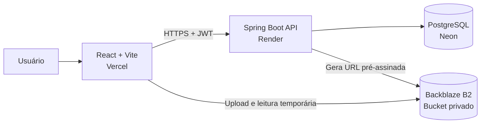
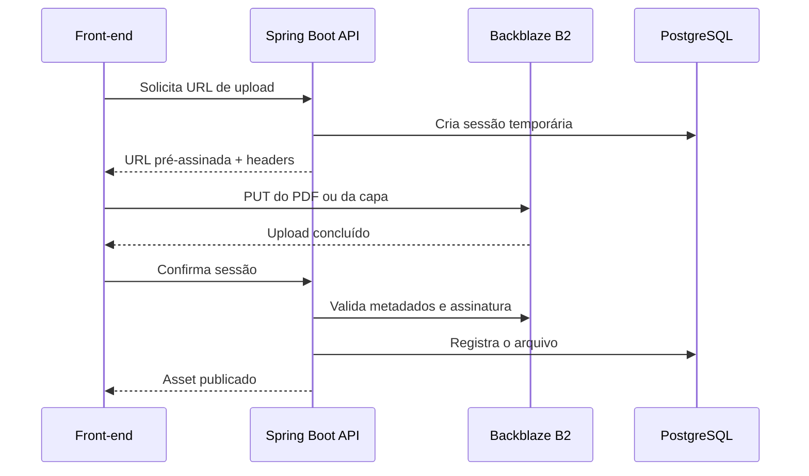

<div align="center">

# Library Management API

### API REST para gestão completa de bibliotecas físicas e digitais

[](#tecnologias)
[](#tecnologias)
[](#tecnologias)
[](#executando-com-docker)
[](#executando-localmente)
[](LICENSE)

[Aplicação web](https://front-end-library-desk-seven.vercel.app) ·
[Swagger](https://library-management-api-pcjj.onrender.com/swagger-ui.html) ·
[Health check](https://library-management-api-pcjj.onrender.com/actuator/health)

</div>

---

## Sobre o projeto

O **Library Management API** é um back-end completo para administração de bibliotecas. O sistema centraliza o controle de usuários, membros, livros, exemplares, empréstimos, devoluções, multas, reservas, notificações e conteúdo digital.

A aplicação foi projetada com foco em regras de negócio reais, segurança baseada em perfis, integridade transacional, versionamento de banco de dados e integração com armazenamento privado compatível com S3.

O projeto acompanha uma aplicação front-end em React e está preparado para execução local, Docker e deploy em produção.

## Principais recursos

### Catálogo e acervo físico

- Cadastro, edição, consulta e desativação lógica de livros.
- Busca por título, autor, ISBN e categoria.
- Filtro por disponibilidade e presença de arquivo digital.
- Controle individual de exemplares por código de inventário.
- Estados de exemplar: disponível, emprestado, reservado, manutenção e perdido.

### Membros e funcionários

- Cadastro de membros com número de matrícula automático.
- Configuração de limite individual de empréstimos.
- Bloqueio, ativação e atualização cadastral.
- Administração de funcionários com perfis `ADMIN` e `LIBRARIAN`.
- Perfil autenticado disponível em `/api/me`.

### Empréstimos, reservas e multas

- Registro de empréstimos com prazo configurável.
- Renovação sujeita a limite, atrasos e fila de reservas.
- Devolução com cálculo automático de multa.
- Consulta de empréstimos próprios para membros.
- Fila de reservas por ordem de solicitação.
- Alocação automática de exemplar disponível.
- Expiração automática do prazo de retirada.
- Pagamento e cancelamento administrativo de multas.

### Biblioteca digital

- Upload privado de PDF e capa por URL pré-assinada.
- Envio direto do navegador para o Backblaze B2.
- Armazenamento compatível com a API S3.
- Validação de tipo, tamanho e assinatura interna do arquivo.
- Capas nos formatos JPEG, PNG e WebP.
- PDFs com limite padrão de 50 MB.
- Níveis de acesso por perfil.
- Download opcional por livro.
- URLs temporárias para leitura e download.
- Progresso de leitura salvo por usuário e livro.
- Expiração e limpeza de sessões de upload incompletas.

### Segurança e automação

- Autenticação stateless com JWT.
- Access token e refresh token.
- Senhas protegidas com BCrypt.
- Autorização por perfil com Spring Method Security.
- CORS configurável por variável de ambiente.
- Rotina agendada para processar atrasos, reservas e notificações.
- Endpoint administrativo para execução manual das rotinas.
- Health check com Spring Boot Actuator.

## Perfis de acesso

| Perfil | Permissões principais |
|---|---|
| `ADMIN` | Administração total, funcionários, exclusões, arquivos digitais e tarefas manuais. |
| `LIBRARIAN` | Gestão de livros, exemplares, membros, empréstimos, reservas e multas. |
| `MEMBER` | Consulta do acervo, reservas, empréstimos próprios, multas próprias e leitura digital. |

## Tecnologias

| Categoria | Tecnologias |
|---|---|
| Linguagem | Java 21 |
| Framework | Spring Boot 3.5 |
| Segurança | Spring Security, OAuth2 Resource Server, JWT, BCrypt |
| Persistência | Spring Data JPA, Hibernate |
| Banco de dados | PostgreSQL |
| Migrations | Flyway |
| Armazenamento | Backblaze B2 via AWS SDK for Java e API S3 |
| Documentação | Springdoc OpenAPI / Swagger UI |
| Validação | Jakarta Bean Validation |
| Build | Maven |
| Infraestrutura | Docker e Docker Compose |
| Testes | Spring Boot Test, Spring Security Test e H2 |
| CI | GitHub Actions |
| Deploy atual | Render, Neon PostgreSQL, Backblaze B2 e Vercel |

## Arquitetura



### Fluxo de upload digital



## Estrutura do projeto

```text
src/main/java/com/carlos/library
├── config          # Segurança, OpenAPI, storage e propriedades
├── controller      # Endpoints REST
├── domain
│   ├── entity      # Entidades JPA
│   └── enums       # Estados e perfis do domínio
├── dto             # Contratos de entrada e saída
├── exception       # Exceções e tratamento global
├── repository      # Repositórios Spring Data JPA
├── scheduler       # Processamento automático de prazos
└── service         # Regras de negócio e integrações

src/main/resources
├── db/migration    # Migrations Flyway
└── application.yml # Configurações da aplicação
```

## Modelo de dados

As migrations criam as seguintes estruturas principais:

- `app_users`
- `members`
- `books`
- `book_copies`
- `loans`
- `reservations`
- `fines`
- `notifications`
- `book_assets`
- `book_upload_sessions`
- `reading_progress`

O projeto inclui índices e restrições para proteger regras críticas, como:

- apenas um empréstimo ativo por exemplar;
- apenas uma reserva ativa por membro e livro;
- apenas um PDF e uma capa por livro;
- apenas um progresso de leitura por usuário e livro.

Consulte o diagrama em [`docs/ERD.md`](docs/ERD.md).

## Pré-requisitos

Para execução local sem Docker:

- Java 21
- Maven 3.9+
- PostgreSQL 15+

Para execução com containers:

- Docker
- Docker Compose

## Configuração do ambiente

Copie o arquivo de exemplo:

### Linux ou macOS

```bash
cp .env.example .env
```

### Windows PowerShell

```powershell
Copy-Item .env.example .env
```

### Banco de dados e autenticação

| Variável | Obrigatória | Padrão local | Descrição |
|---|:---:|---|---|
| `DB_URL` | Sim | `jdbc:postgresql://localhost:5432/library_db` | URL JDBC do PostgreSQL. |
| `DB_USERNAME` | Sim | `library` | Usuário do banco. |
| `DB_PASSWORD` | Sim | `library` | Senha do banco. |
| `APP_JWT_SECRET` | Sim | — | Segredo HS256 com pelo menos 32 caracteres. |
| `JWT_ACCESS_MINUTES` | Não | `30` | Duração do access token. |
| `JWT_REFRESH_DAYS` | Não | `7` | Duração do refresh token. |
| `CORS_ALLOWED_ORIGINS` | Sim em produção | `http://localhost:5173` | Origens permitidas, separadas por vírgula. |

### Administrador inicial

| Variável | Padrão local | Descrição |
|---|---|---|
| `ADMIN_NAME` | `Administrador` | Nome do administrador inicial. |
| `ADMIN_EMAIL` | `admin@library.local` | E-mail do administrador inicial. |
| `ADMIN_PASSWORD` | `Admin@123456` | Senha inicial. Altere em produção. |

### Regras da biblioteca

| Variável | Padrão | Descrição |
|---|---:|---|
| `DEFAULT_LOAN_DAYS` | `14` | Prazo padrão do empréstimo. |
| `MAX_RENEWALS` | `2` | Máximo de renovações. |
| `RESERVATION_HOLD_HOURS` | `48` | Prazo para retirada de reserva. |
| `DUE_SOON_DAYS` | `2` | Antecedência da notificação de vencimento. |
| `DAILY_FINE` | `2.00` | Valor da multa por dia de atraso. |
| `MAX_UNPAID_FINE` | `20.00` | Limite de multa pendente para novos empréstimos. |
| `DEADLINES_CRON` | `0 0 8 * * *` | Expressão cron das rotinas diárias. |
| `SCHEDULER_ZONE` | `America/Maceio` | Fuso horário do scheduler. |

### Backblaze B2

> O prefixo `R2_` foi mantido por compatibilidade interna, mas os valores são referentes ao Backblaze B2.

| Variável | Padrão | Descrição |
|---|---|---|
| `R2_ENABLED` | `false` | Habilita a biblioteca digital. |
| `R2_ENDPOINT` | — | Endpoint S3 do bucket. |
| `R2_REGION` | `us-east-005` | Região do bucket. |
| `R2_ACCESS_KEY_ID` | — | Key ID da Application Key. |
| `R2_SECRET_ACCESS_KEY` | — | Application Key secreta. |
| `R2_BUCKET` | — | Nome do bucket privado. |
| `R2_UPLOAD_EXPIRATION_MINUTES` | `15` | Validade da URL de upload. |
| `R2_ACCESS_EXPIRATION_MINUTES` | `60` | Validade da URL de leitura. |
| `R2_MAX_PDF_BYTES` | `52428800` | Limite do PDF: 50 MB. |
| `R2_MAX_COVER_BYTES` | `5242880` | Limite da capa: 5 MB. |

Nunca envie `.env`, senhas, chaves JWT ou credenciais do storage para o GitHub.

## Executando com Docker

```bash
docker compose up --build
```

Serviços disponíveis:

| Serviço | URL |
|---|---|
| API | `http://localhost:8080` |
| Swagger UI | `http://localhost:8080/swagger-ui.html` |
| OpenAPI JSON | `http://localhost:8080/v3/api-docs` |
| Health check | `http://localhost:8080/actuator/health` |
| PostgreSQL | `localhost:5432` |

Para encerrar:

```bash
docker compose down
```

Para remover também o volume do PostgreSQL:

```bash
docker compose down -v
```

## Executando localmente

Crie o banco PostgreSQL e configure as variáveis de ambiente. Depois:

```bash
mvn clean spring-boot:run
```

Ou gere o JAR:

```bash
mvn clean package -DskipTests
java -jar target/library-management-api-1.0.0.jar
```

## Autenticação

### Login

```bash
curl -X POST http://localhost:8080/api/auth/login \
  -H "Content-Type: application/json" \
  -d '{
    "email": "admin@library.local",
    "password": "Admin@123456"
  }'
```

Resposta:

```json
{
  "tokenType": "Bearer",
  "accessToken": "eyJ...",
  "refreshToken": "eyJ...",
  "expiresIn": 1800
}
```

Envie o access token nas rotas protegidas:

```http
Authorization: Bearer SEU_ACCESS_TOKEN
```

### Renovação do token

```bash
curl -X POST http://localhost:8080/api/auth/refresh \
  -H "Content-Type: application/json" \
  -d '{"refreshToken":"SEU_REFRESH_TOKEN"}'
```

## Endpoints principais

### Autenticação e perfil

| Método | Endpoint | Acesso | Descrição |
|---|---|---|---|
| `POST` | `/api/auth/login` | Público | Autentica um usuário. |
| `POST` | `/api/auth/register` | Público | Cadastra um membro. |
| `POST` | `/api/auth/refresh` | Público | Renova os tokens. |
| `GET` | `/api/me` | Autenticado | Retorna o perfil atual. |

### Livros e exemplares

| Método | Endpoint | Acesso | Descrição |
|---|---|---|---|
| `GET` | `/api/books` | Autenticado | Lista e filtra livros. |
| `GET` | `/api/books/{id}` | Autenticado | Detalha um livro. |
| `POST` | `/api/books` | `ADMIN`, `LIBRARIAN` | Cadastra um livro. |
| `PUT` | `/api/books/{id}` | `ADMIN`, `LIBRARIAN` | Atualiza um livro. |
| `DELETE` | `/api/books/{id}` | `ADMIN` | Desativa um livro. |
| `POST` | `/api/books/{bookId}/copies` | `ADMIN`, `LIBRARIAN` | Adiciona um exemplar. |
| `GET` | `/api/books/{bookId}/copies` | Autenticado | Lista exemplares. |
| `PATCH` | `/api/books/copies/{copyId}/status` | `ADMIN`, `LIBRARIAN` | Altera o estado do exemplar. |

Parâmetros disponíveis em `GET /api/books`:

- `query`
- `category`
- `availableOnly`
- `digitalOnly`
- `page`
- `size`
- `sort`

### Biblioteca digital

| Método | Endpoint | Acesso | Descrição |
|---|---|---|---|
| `GET` | `/api/digital-library/books` | Autenticado | Lista os livros digitais acessíveis. |
| `POST` | `/api/books/{bookId}/assets/upload-url` | `ADMIN` | Gera URL pré-assinada. |
| `POST` | `/api/books/{bookId}/assets/uploads/{sessionId}/confirm` | `ADMIN` | Confirma e valida o upload. |
| `GET` | `/api/books/{bookId}/assets` | Autenticado | Lista arquivos permitidos. |
| `GET` | `/api/books/{bookId}/assets/{type}/access` | Autenticado | Gera URL temporária. |
| `DELETE` | `/api/books/{bookId}/assets/{type}` | `ADMIN` | Remove PDF ou capa. |
| `GET` | `/api/books/{bookId}/reading-progress` | Autenticado | Consulta o progresso. |
| `PUT` | `/api/books/{bookId}/reading-progress` | Autenticado | Atualiza o progresso. |

Tipos de arquivo:

```text
PDF
COVER
```

Níveis de acesso:

```text
PUBLIC
MEMBERS_ONLY
STAFF_ONLY
ADMIN_ONLY
```

### Demais módulos

| Base | Responsabilidade |
|---|---|
| `/api/members` | Cadastro e administração de membros. |
| `/api/staff` | Administração de funcionários. |
| `/api/loans` | Empréstimos, renovação e devolução. |
| `/api/reservations` | Fila e cancelamento de reservas. |
| `/api/fines` | Consulta, pagamento e cancelamento de multas. |
| `/api/notifications` | Notificações do usuário autenticado. |
| `/api/admin/tasks` | Execução manual das rotinas agendadas. |

A documentação completa e interativa está disponível no Swagger UI.

## Exemplo: cadastrar um livro

```bash
curl -X POST http://localhost:8080/api/books \
  -H "Authorization: Bearer SEU_ACCESS_TOKEN" \
  -H "Content-Type: application/json" \
  -d '{
    "title": "Código Limpo",
    "isbn": "9788576082675",
    "author": "Robert C. Martin",
    "publisher": "Alta Books",
    "publicationYear": 2009,
    "category": "Engenharia de Software",
    "description": "Princípios e boas práticas para desenvolvimento de software."
  }'
```

## Regras de negócio importantes

- Membros bloqueados ou inativos não podem emprestar nem reservar.
- O limite de empréstimos é configurável por membro.
- Empréstimos atrasados impedem novas operações e renovações.
- Multas acima do limite configurado bloqueiam novos empréstimos.
- Um exemplar não pode possuir dois empréstimos ativos simultaneamente.
- Um membro não pode manter duas reservas ativas para o mesmo livro.
- A ordem da fila de reservas precisa ser respeitada.
- A devolução atrasada gera multa por dia.
- Livros com empréstimos ou reservas incompatíveis não podem ser desativados.
- Arquivos digitais somente são publicados após validação no storage.
- O usuário só recebe arquivos compatíveis com seu nível de acesso.

## Testes

Execute a suíte completa:

```bash
mvn clean verify
```

Somente testes:

```bash
mvn test
```

A pipeline em `.github/workflows/ci.yml` executa `mvn clean verify` em pushes e pull requests.

## Migrations

O Flyway executa automaticamente:

```text
V1__create_schema.sql
V2__digital_library.sql
```

O Hibernate utiliza:

```yaml
ddl-auto: validate
```

Assim, a aplicação valida o schema existente sem alterar silenciosamente a estrutura do banco.

## Deploy

### Back-end no Render

Configuração sugerida:

```text
Runtime: Docker
Health Check Path: /actuator/health
```

Configure no painel todas as variáveis relacionadas ao banco, JWT, CORS, administrador e storage.

### PostgreSQL no Neon

Utilize a URL JDBC fornecida pelo Neon:

```text
jdbc:postgresql://HOST/DB?sslmode=require
```

### Backblaze B2

- Mantenha o bucket como `allPrivate`.
- Gere uma Application Key com acesso apenas ao bucket da aplicação.
- Configure as regras CORS do bucket para `s3_put`, `s3_get` e `s3_head`.
- Nunca exponha o `R2_SECRET_ACCESS_KEY` no front-end.

Consulte o guia em [`docs/BACKBLAZE_B2.md`](docs/BACKBLAZE_B2.md).

## Documentação adicional

- [`docs/ERD.md`](docs/ERD.md) — modelo de dados.
- [`docs/DIGITAL_LIBRARY.md`](docs/DIGITAL_LIBRARY.md) — fluxo da biblioteca digital.
- [`docs/BACKBLAZE_B2.md`](docs/BACKBLAZE_B2.md) — configuração do storage.
- [`postman/Library-Management-API.postman_collection.json`](postman/Library-Management-API.postman_collection.json) — collection do Postman.

## Segurança

- Não versione `.env`.
- Rotacione imediatamente qualquer chave exposta.
- Use um `APP_JWT_SECRET` longo e exclusivo.
- Limite as origens CORS aos domínios realmente utilizados.
- Restrinja a Application Key do Backblaze ao bucket necessário.
- Use HTTPS em todos os ambientes de produção.
- Troque as credenciais administrativas padrão antes do primeiro deploy.

## Autor

Desenvolvido por **Carlos Lima**.

[](https://github.com/developercarloslima)

## Direitos autorais

© 2026 Carlos Lima. Todos os direitos reservados.

Este repositório está disponível para fins de demonstração e portfólio. A cópia, modificação, distribuição ou utilização comercial do código não é permitida sem autorização prévia.