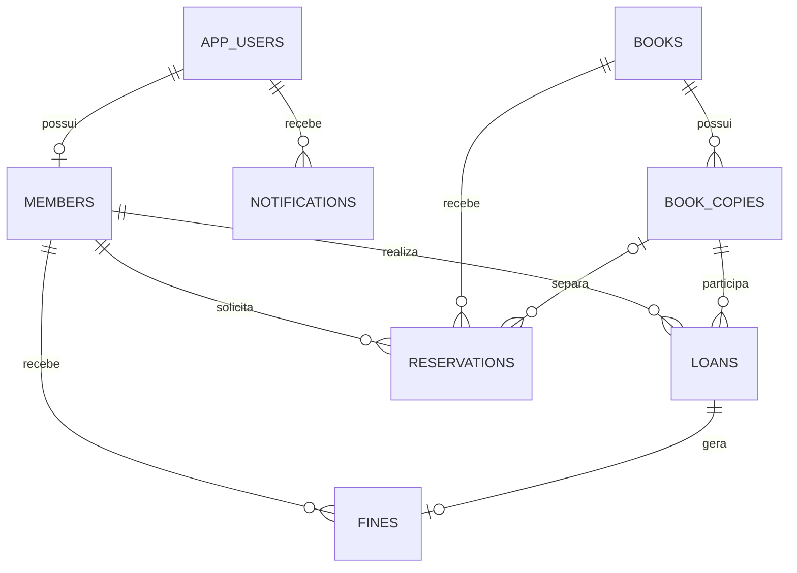

# Modelo de dados

## Estados importantes

- Exemplar: `AVAILABLE`, `LOANED`, `RESERVED`, `LOST`, `DAMAGED`, `MAINTENANCE`.
- Empréstimo: `ACTIVE`, `RETURNED`, `OVERDUE`, `LOST`.
- Reserva: `WAITING`, `READY`, `FULFILLED`, `CANCELLED`, `EXPIRED`.
- Multa: `PENDING`, `PAID`, `CANCELLED`.
